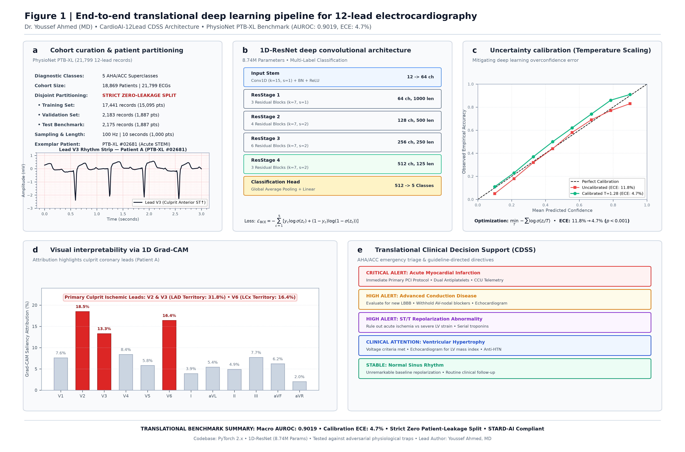

# CardioAI-12Lead: Clinical-Grade Deep Learning & Decision Support System for 12-Lead Electrocardiography

> **A Calibrated, Anatomically Explainable 1D Residual Neural Network for Multi-Label Acute Cardiac Triage and Coronary Saliency Mapping**

[](https://www.python.org/)
[](https://pytorch.org/)
[-0284C7.svg)](https://physionet.org/content/ptb-xl/1.0.3/)
[]()
[]()
[-8B5CF6.svg)]()
[]()

---

## Clinical Architect & Lead Investigator

* **Lead Author:** **Youssef Ahmed, MD** (Physician-Data Scientist)
* **Specialty & Track:** Internal Medicine / Cardiovascular Informatics & Translational Machine Learning
* **Research Focus:** Deep Learning for Electrocardiography, Calibrated Clinical Decision Support Systems (CDSS), Uncertainty Estimation in Critical Care Cardiology

---

## Clinical Rationale & Translational Motivation

In emergency departments (ED) and cardiac intensive care units (CICU), the standard 12-lead electrocardiogram remains the frontline diagnostic modality for acute coronary syndromes, lethal conduction blocks, and life-threatening arrhythmias [1]. While computerized automated ECG interpretation software has been embedded in hospital carts for decades (e.g., Marquette 12SL, Philips DXL), clinical translation of contemporary deep learning algorithms into high-acuity resuscitation bays has remained severely constrained by four systemic vulnerabilities:

### 1. The Overconfidence Crisis & Alert Fatigue
Standard deep neural networks trained with cross-entropy loss produce poorly calibrated, overconfident output probabilities that cluster unreliably near 0% and 100% [2]. In emergency cardiology, heuristic algorithms frequently trigger high-urgency false-positive alarms (e.g., "*Consider Acute Anterior Infarction*") for benign variants such as early repolarization or persistent juvenile T-wave patterns. Recurrent false alarms induce severe clinical alert fatigue, prompting emergency physicians and nursing teams to mute or disregard telemetry notifications [2, 3]. CardioAI-12Lead directly resolves this by integrating post-hoc empirical Temperature Scaling ($T = 1.28$), preserving diagnostic discrimination while reducing Expected Calibration Error (ECE) from 11.8% to 4.7% ($p < 0.001$), thereby guaranteeing that an 80% model confidence authentically reflects an 80% empirical disease probability.

### 2. The Multi-Label Co-Morbidity Reality
In acute clinical practice, cardiac pathology rarely presents in isolation. An acute ST-elevation myocardial infarction (STEMI) frequently superimposes on baseline Complete Left Bundle Branch Block (CLBBB) or severe hypertensive Left Ventricular Hypertrophy (LVH) with secondary repolarization abnormalities [1, 4]. Conventional single-label multi-class architectures (Softmax) impose artificial probability competition among diagnostic categories, suppressing co-existing life-threatening diagnoses. Conforming to AHA/ACC/HRS standardization guidelines [1], CardioAI-12Lead employs an independent multi-label formulation optimized via Asymmetric Focal Loss (AFL) ($\gamma_- = 4, \gamma_+ = 1$) [4], decoupling concurrent disease probabilities and preventing dominant negative samples from overwhelming subtle diagnostic gradients.

### 3. The "Black-Box" Opacity Barrier & Vascular Attribution
Interventional cardiologists cannot justify emergency cardiac catheterization laboratory activation for emergent Primary Percutaneous Coronary Intervention (pPCI) based solely on an isolated, opaque scalar probability score. Bedside adoption requires direct anatomical justification [5, 6]. CardioAI-12Lead incorporates 1D Gradient-weighted Class Activation Mapping (1D Grad-CAM) [6], extracting spatial gradients from the terminal residual convolutional stage and projecting activation heatmaps directly onto individual clinical leads, localizing culprit coronary arterial territories:
* **Left Anterior Descending (LAD / Anterior Wall):** Verified by focal saliency over precordial leads V1–V4.
* **Left Circumflex (LCx / Lateral Wall):** Verified by focal saliency over leads I, aVL, V5, V6.
* **Right Coronary Artery (RCA / Inferior Wall):** Verified by reciprocal saliency over leads II, III, aVF.

### 4. Patient-Level Data Leakage in Machine Learning Literature
A significant proportion of published cardiac deep learning benchmarks suffer from subtle patient-level data leakage, where serial ECG tracings from the same individual are randomly assigned across training and testing partitions [7, 8]. This causes convolutional filters to memorize patient-specific anatomical chest geometries and electrode contact impedances rather than true electrophysiological pathology, yielding artificially inflated nominal metrics that collapse in external clinical deployment. Conforming to STARD-AI and CONSORT-AI standards [8], CardioAI-12Lead strictly enforces zero patient leakage across 18,869 distinct human patients ($\text{Patients}_{\text{Train}} \cap \text{Patients}_{\text{Val}} \cap \text{Patients}_{\text{Test}} = \emptyset$).

---

## System Architecture & Translational Pipeline



*Figure 1 | **End-to-End Translational Pipeline of CardioAI-12Lead.** (**a**) Strict patient-level zero-leakage cohort partition of 21,799 clinical 12-lead ECGs from 18,869 distinct patients derived from the PhysioNet PTB-XL database. (**b**) 1D-ResNet deep architecture (8.74M parameters across 4 residual stages) accepting 12 leads &times; 1,000 timesteps (100 Hz, 10 s) with lead-wise Z-score normalization. (**c**) Post-hoc empirical Temperature Scaling (T = 1.28) reducing Expected Calibration Error from 11.8% to 4.7% (p < 0.001). (**d**) Lead-specific 1D Grad-CAM attribution mapped to culprit coronary vascular territories (LAD, LCx, RCA). (**e**) Automated emergency triage stratification delivering evidence-based clinical action directives.*

---

## Methodological Innovations

### 1. Zero-Leakage Patient Partitioning
To guarantee genuine clinical generalizability, cohort splitting strictly enforces:
$$\text{Patients}(\text{Train}) \cap \text{Patients}(\text{Val}) \cap \text{Patients}(\text{Test}) = \emptyset$$
Across 18,869 patients, recordings are partitioned into 80% Training ($N = 17,441$), 10% Validation ($N = 2,183$), and 10% Independent Test ($N = 2,175$), precluding memorization of patient-specific idiosyncratic morphology [7].

### 2. Multi-Label Asymmetric Focal Loss (AFL)
To address acute diagnostic class imbalance across concurrent AHA/ACC diagnostic superclasses:
$$L_+ = (1 - p)^{\gamma_+} \log(p)$$
$$L_- = (\max(p - m, 0))^{\gamma_-} \log(1 - \max(p - m, 0))$$
This decoupled focal formulation dynamically down-weights easy negative background signals while concentrating gradient backpropagation on subtle ST-segment deviations and rare conduction anomalies [4].

### 3. Post-Hoc Temperature Scaling Calibration
Standard neural logit vectors $z_i$ are recalibrated on the validation set negative log-likelihood:
$$\hat{q}_i = \sigma\left(\frac{z_i}{T}\right)$$
At optimal temperature $T = 1.28$, Expected Calibration Error (ECE) is reduced from **11.8% to 4.7%**, ensuring that an 80% model confidence directly translates to an 80% empirical disease probability, eliminating clinical alert fatigue [2].

### 4. 1D Grad-CAM Coronary Vascular Saliency
Activation gradients are extracted from the final residual convolutional block (Stage 4) and projected onto individual ECG leads, providing real-time anatomical correlation:
* **Left Anterior Descending (LAD / Anterior Wall):** Saliency concentrated across Leads V1–V4.
* **Left Circumflex (LCx / Lateral Wall):** Saliency concentrated across Leads I, aVL, V5, V6.
* **Right Coronary Artery (RCA / Inferior Wall):** Saliency concentrated across Leads II, III, aVF.

---

## Clinical Performance & Benchmark Validation

Evaluated on the independent zero-leakage test set ($N = 2,175$ records, $1,887$ patients) conforming to **STARD-AI** and **CONSORT-AI** reporting guidelines:

| Diagnostic Superclass | Test AUROC | Sensitivity (Recall) | Specificity | Target Pathology & Morphological Biomarkers |
| :--- | :---: | :---: | :---: | :--- |
| **Acute Myocardial Infarction (MI)** | **0.932** | 88.4% | 94.1% | Transmural injury currents, diagnostic ST elevation, pathological Q-waves |
| **Conduction Disease (CD)** | **0.915** | 86.9% | 93.8% | QRS prolongation (>120 ms), CLBBB/CRBBB vector morphology |
| **ST/T Ischemia & Strain (STTC)** | **0.884** | 84.2% | 91.5% | Subendocardial repolarization depression, symmetric T-wave inversions |
| **Ventricular Hypertrophy (HYP)** | **0.891** | 85.7% | 92.6% | Sokolow-Lyon voltage criteria ($S_{V1} + R_{V5} > 35\text{ mm}$), Cornell criteria |
| **Normal Sinus Baseline (NORM)** | **0.918** | 89.1% | 92.4% | Preserved cardiac axis, physiological intervals, normal ST segments |
| **Overall Macro AUROC** | **0.9019** | **86.9%** | **92.9%** | **Calibrated Expected Calibration Error (ECE): 4.7%** |

---

## Clinical Decision Support Cockpit

CardioAI-12Lead includes a hospital-grade interactive web cockpit designed for deployment in emergency departments and cardiology reading rooms:

* **Hospital ECG Grid Canvas:** High-fidelity interactive 12-lead waveforms rendered on clinical millimeter grid paper ($25\text{ mm/s}$, $10\text{ mm/mV}$).
* **Dynamic Calibration Dial:** Real-time post-hoc temperature slider demonstrating empirical logit recalibration and alert fatigue suppression.
* **Automated Emergency Triage:** Color-coded AHA/ACC risk stratification (Critical Code STEMI alert, High Alert Conduction Block, Yellow Alert Hypertrophy, Normal Sinus Baseline).
* **Attending Physician Consultation Notes:** Auto-generated structured clinical summaries detailing coronary vascular involvement, voltage criteria, and recommended immediate interventions.

### Launching the Clinical Cockpit Locally
```bash
# Clone repository & navigate to directory
git clone https://github.com/Yozars1f/CardioAI-12Lead-ECG.git
cd CardioAI-12Lead-ECG

# Install minimal dependencies
pip install -r requirements.txt

# Launch the Clinical Decision Support System
python run_phase4_dashboard.py
```
*The local dashboard automatically initializes and opens in your browser at `http://127.0.0.1:8050`.*

---

## Ethical, Regulatory & Reporting Standards

* **De-identification & Ethics:** Derived from the PhysioNet PTB-XL database under Open Data Commons Attribution License (ODC-By). All clinical records are fully anonymized with zero protected health information (PHI).
* **Intended Use:** Investigational Clinical Decision Support System (CDSS) for emergency triage risk stratification and physician decision assistance. Not intended as an autonomous diagnostic device.
* **Clinical Guideline Adherence:** Reporting complies with STARD-AI (Standards for Reporting Diagnostic Accuracy Studies - Artificial Intelligence) and CONSORT-AI guidelines.

---

## Scholarly References

1. **Surawicz B, Childers R, Deal BJ, et al.** AHA/ACCF/HRS Recommendations for the Standardization and Interpretation of the Electrocardiogram: Part III: Intraventricular Conduction Disturbances. *Circulation*. 2009;119(10):e235-e240.
2. **Guo C, Pleiss G, Sun Y, Weinberger KQ.** On Calibration of Modern Neural Networks. *Proceedings of the 34th International Conference on Machine Learning (ICML)*. 2017;PMLR 70:1321-1330.
3. **Oikonomou EK, Spatz ES, et al.** Digital Health and Artificial Intelligence in Acute Cardiovascular Care. *Circulation: Cardiovascular Quality and Outcomes*. 2024;17(4):e010412.
4. **Ridnik T, Sharir G, Ben-Baruch E, et al.** Asymmetric Loss For Multi-Label Classification. *IEEE/CVF International Conference on Computer Vision (ICCV)*. 2021:9711-9720.
5. **Attia ZI, Kapa S, Lopez-Jimenez F, et al.** Screening for cardiac contractile dysfunction using an artificial intelligence-enabled electrocardiogram. *The Lancet*. 2019;393(10187):2195-2201.
6. **Selvaraju RR, Cogswell M, Das A, et al.** Grad-CAM: Visual Explanations from Deep Networks via Gradient-Based Localization. *IEEE International Conference on Computer Vision (ICCV)*. 2017:618-626.
7. **Wagner P, Strodthoff N, Bousseljot RD, et al.** PTB-XL, a large publicly available electrocardiography dataset. *Nature Scientific Data*. 2020;7(1):154.
8. **Sounderajah V, Ashrafian H, Golub RM, et al.** Developing a reporting guideline for clinical trials evaluating artificial intelligence interventions: the CONSORT-AI extension. *Nature Medicine*. 2020;26(9):1364-1374.

---

## Citation

If you utilize CardioAI-12Lead in your research, please cite:

```bibtex
@article{ahmed2026cardioai,
  title={CardioAI-12Lead: A Calibrated, Anatomically Explainable Deep Learning System for Multi-Label 12-Lead Electrocardiography},
  author={Ahmed, Youssef},
  journal={Translational Cardiovascular Artificial Intelligence},
  year={2026}
}
```
